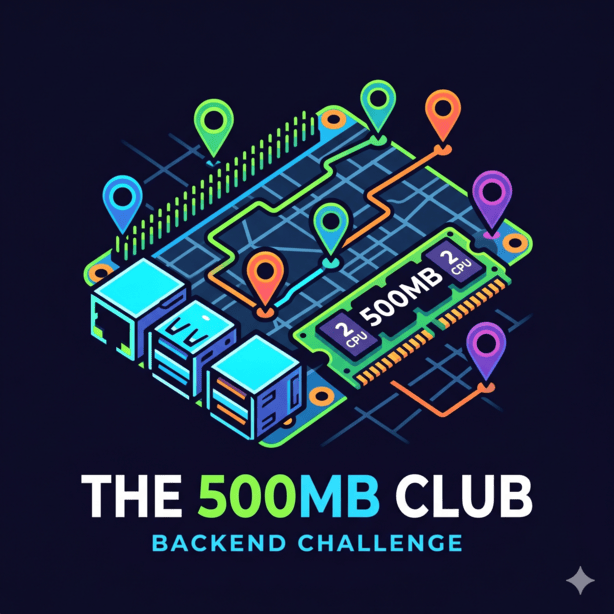
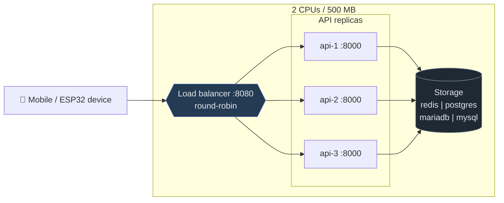
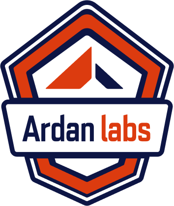

# The 500MB Club Challenge - Backend language benchmark on constrained edge hardware

[🇧🇷 Português](docs/pt-br/participating.md) | [🇺🇸 English](docs/en/participating.md)

> 📅 **Deadline: July 26, 2026, 10pm UTC.**

Você vai construir um serviço de ingestão e consulta de telemetria de dispositivos (**lat/lon, bateria, aceleração nos 3 eixos**). A escolha do domínio é proposital: tem write-heavy realista, leitura por janela temporal e uma rota CPU-bound para evitar que o vencedor seja só "quem faz menos coisa".

A ideia é comparar runtimes de backend em hardware de borda real (Raspberry Pi), com a stack inteira limitada a **2 CPUs e 500 MB de RAM**.

## Cenário

Uma plataforma de delivery e mobilidade (_pense nos líderes do mercado_) que opera milhares de entregadores e motoristas simultâneos numa cidade. Cada profissional roda um app que reporta posição GPS, bateria do celular e acelerômetro continuamente enquanto está em rota. O backend precisa: ingerir esse fluxo em escala, deixar o cliente final acompanhar "seu pedido está chegando" (_query da rota recente_), e detectar anomalias operacionais (entregador parado tempo demais, possível acidente via acelerômetro, desvio suspeito).

Esse é o serviço que, na vida real, fica atrás do mapinha que se mexe na tela quando você espera o jantar ou o carro. É write-heavy, latência-sensível na cauda (_mapa que trava irrita o cliente_), e roda em escala.

Este repositório contém **apenas a infraestrutura compartilhada**: 2 scripts de carga k6 (smoke e test) e o contrato OpenAPI. Cada submissão implementa a própria API na linguagem de sua escolha e publica uma imagem Docker que se encaixa nessa moldura.

> **Como participar** — quick start, regras de fairness, pontuação, entregáveis, endpoints e hardware estão no guia completo: [`docs/pt-br/participating.md`](docs/pt-br/participating.md).

## Patrocinadores

Este desafio é possível graças aos nossos patrocinadores:

  &nbsp;&nbsp;&nbsp;
  &nbsp;&nbsp;&nbsp;
  

Veja os prêmios e como os ganhadores são definidos: [🇧🇷 Premiações](docs/pt-br/prizes.md) | [🇺🇸 Prizes](docs/en/prizes.md).

## Documentação / Documentation

Índice completo em ordem de leitura sugerida — do "como entrar" até os detalhes de cada dimensão de pontuação.
Full index in suggested reading order — from "how to join" to the details of each scoring dimension.

### 🇧🇷 Português

1. [Como participar](docs/pt-br/participating.md) — quick start, regras, hardware
2. [Submetendo sua implementação](docs/pt-br/submitting.md)
3. [Contrato da API](docs/pt-br/api.md) — endpoints e payloads
4. [Pontuação — visão geral](docs/pt-br/scoring.md) — gate, fórmula, medalhas
5. [Dimensões do score — guia detalhado](docs/pt-br/README.md) (índice das 5 dimensões)
   1. [Eficiência](docs/pt-br/efficiency.md) (32%) — RAM + CPU sob carga base
   2. [Capacidade](docs/pt-br/capacity.md) (27%) — RPS máximo sustentado
   3. [Latência de cauda](docs/pt-br/tail-latency.md) (20%) — p99 no `steady`
   4. [Resiliência](docs/pt-br/resilience.md) (13%) — comportamento no pico
   5. [Estabilidade](docs/pt-br/stability.md) (8%) — deriva ao longo do tempo
6. [Testing](docs/pt-br/testing.md) — como reproduzir o bench no Pi
7. [Premiações](docs/pt-br/prizes.md)

### 🇺🇸 English

1. [How to participate](docs/en/participating.md) — quick start, rules, hardware
2. [Submitting your implementation](docs/en/submitting.md)
3. [API contract](docs/en/api.md) — endpoints and payloads
4. [Scoring — overview](docs/en/scoring.md) — gate, formula, medals
5. [Score dimensions — detailed guide](docs/en/README.md) (index of the 5 dimensions)
   1. [Efficiency](docs/en/efficiency.md) (32%) — RAM + CPU under base load
   2. [Capacity](docs/en/capacity.md) (27%) — max sustained RPS
   3. [Tail latency](docs/en/tail-latency.md) (20%) — p99 on `steady`
   4. [Resilience](docs/en/resilience.md) (13%) — behavior under spike
   5. [Stability](docs/en/stability.md) (8%) — drift over time
6. [Testing](docs/en/testing.md) — how to reproduce the bench on the Pi
7. [Prizes](docs/en/prizes.md)

Made with ❤️ by [Carlos Henrique Gandarez](https://www.linkedin.com/in/gandarez/?locale=en_US)